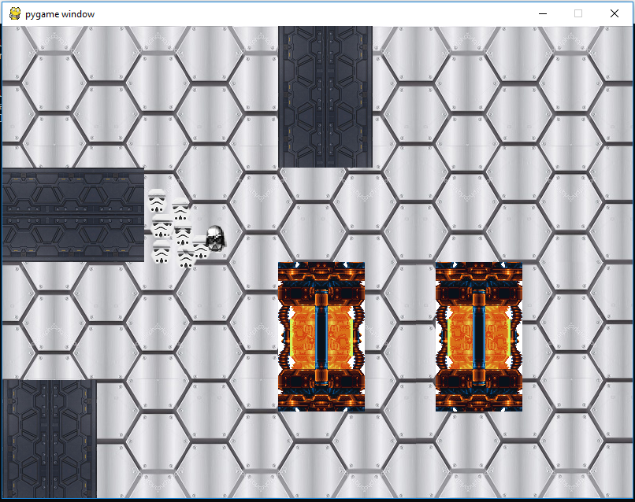

# Boids

Implémentation de Flocking.

Les déplacements des boids respectent trois contraintes :
- L'attraction (le rapprochement d'un boid par rapport à ses voisins => rapproche un boid s'il est trop loin de ses voisins)
- La répulsion (l'éloignement d'un boid par rapport à ses voisins => s'éloigne s'il est trop proche de ses voisins)
- La direction (la direction d'un boid => direction définie en calculant la moyenne des directions des ses voisins)

(Dans cette implémentation, les boids évitent aussi les obstacles)

La position suivante d'un boid est determiné par ces trois facteurs. Ces facteurs sont calculés en fonction du nombre de voisins compris dans un rayon et de leurs position par rapport à un boid. Ce procesus est réalisé pour chacun des boids pour définir leur positions suivantes.

# Ici, Darth Vader et ses sbires les storm trooper boids

